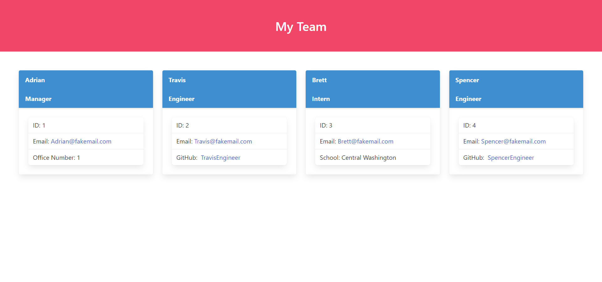

  # Team-Profile-Generator
  
  ## Description
  

  This application is designed to aid a software engineering team create an organized list of their employees. It allows the user to create a simple webpage that lists the employees in an easy to read format. The application lists the employee's name, role, email and id along with additional information depending on the employee's role. 
  

  
  ## Table of Contents

  - [Installation](#installation)
  - [Usage](#usage)
  
  - [Contributing](#contributing)
  - [Tests](#tests)
  - [Questions](#questions)
  
  
  
  ## Installation

  1. Clone down the repository files
  
  2. Open a terminal at the root folder

  3. Type `npm i` in the terminal
   
  ## Usage

  [Demonstration Video](https://drive.google.com/file/d/1Epf0DvQ6DzlLIO9vPFmwNIEIC8WjFaNg/view?usp=sharing)

  Type `node index.js` in the terimnal and follow the prompts

  Example of generated webpage

  
  
## Contributing

Fork a copy, make your enhancements, make a pull request and contact me via the contact information in the [Questions](#questions) section

  
  
## Tests

1. Open a terminal in the root folder

2. Type `npm test`
  
  ## Questions

  For any additional questions please reach out to me at:

  [My Github Profile](https://github.com/AdrianCronin)

  [Email](mailto:acronindev@gmail.com)
  
